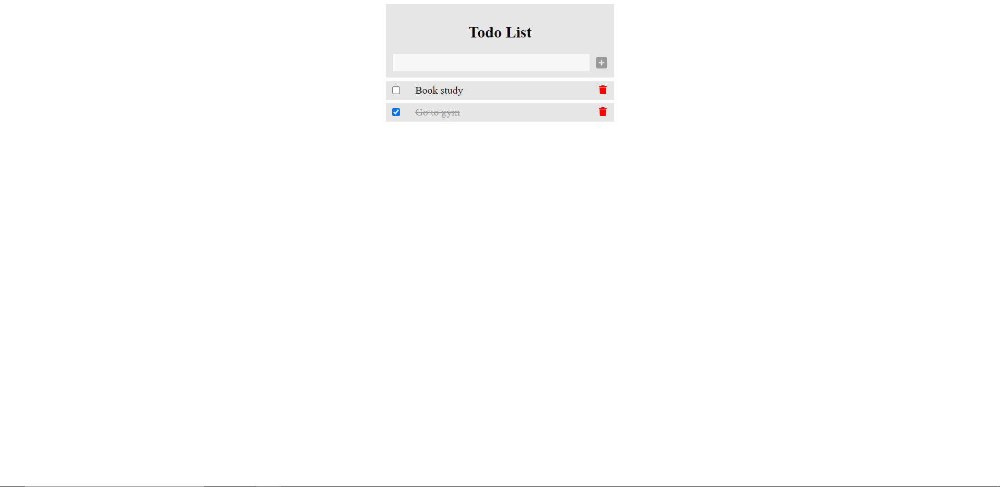

# The Todo List

### Screen shot of project

# Technologies used:

-   Laravel
-   Mysql
-   Vue.js

## Steps for install and using this project:

1. clone the project
2. run `composer install` in root directory
3. run `npm install && npm run dev` for install vue and dependencies
4. create `todolist` database or edit `.env` file
5. run `php artisan migrate` to create tables in your database
6. run `php artisan serve` and open [http://127.0.0.1:8000](http://127.0.0.1:8000) in your browser to see and using todo list
